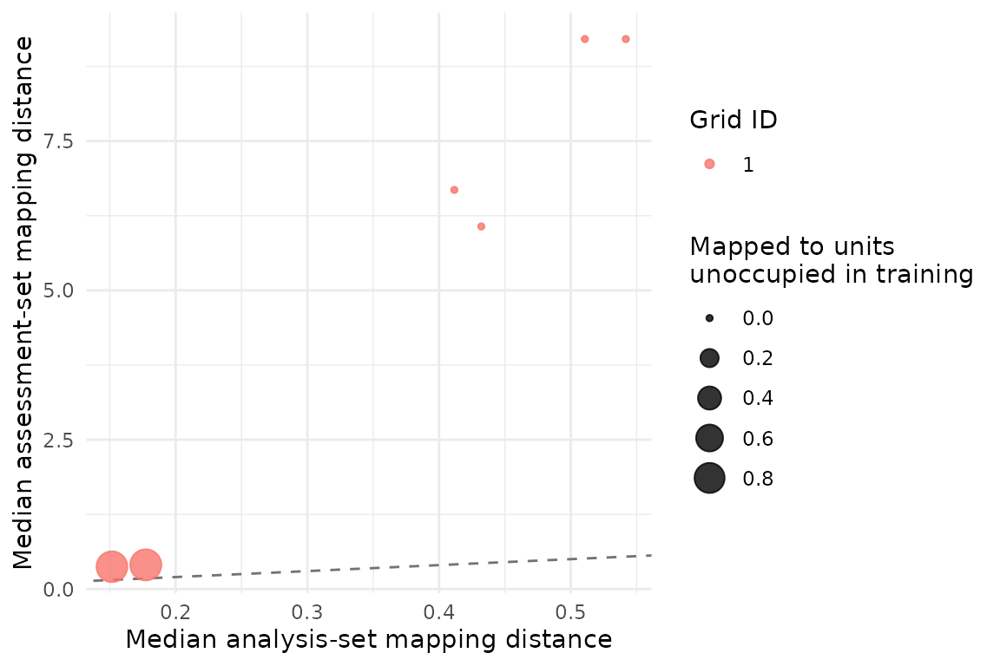

# Respecting groups and monitoring domains in SOM validation

## Why the resampling unit matters

Environmental and ecological tables often contain repeated observations
from the same site, individual, transect, campaign or watershed.
Treating those rows as independent can place closely related
observations in both the analysis and assessment subsets. A model may
then appear reproducible because it repeatedly sees the same sampling
unit, not because the pattern transfers to a new unit.

`SOMevidence` stores the sampling hierarchy outside the predictor matrix
and requires the resampling design to be stated. The example below
creates a known three-class system with strong site-level dependence.
Class labels remain external to training.

``` r

library(SOMevidence)

grouped <- simulate_som_scenario(
  "grouped_pseudoreplication",
  n = 120,
  p = 6,
  n_groups = 20,
  group_icc = 0.7,
  seed = 101
)
grouped
#> <som_data>
#>   samples: 120 
#>   layers : 1 
#>   id source: generated 
#>     - environment: 6 variables, 0.0% missing
#>   design : group, external_label
```

Row resampling and site resampling answer different questions. The
latter asks whether a partition can be reproduced after entire sites are
withheld.

``` r

row_splits <- som_resamples(
  grouped, method = "subsample", repeats = 3, prop = 0.8, seed = 102
)
site_splits <- som_resamples(
  grouped, method = "group_subsample", repeats = 3, prop = 0.8, seed = 102
)

spec <- som_spec(
  grids = list(c(3, 2), c(4, 3)),
  seeds = c(103, 104),
  rlen = 40,
  k = 2:4
)
```

Both workflows use the same SOM budget and preprocessing. Only the
resampling unit changes.

``` r

row_result <- run_som_workflow(
  grouped, spec, row_splits,
  cross_models = c("kmeans", "ward")
)
site_result <- run_som_workflow(
  grouped, spec, site_splits,
  cross_models = c("kmeans", "ward")
)

row_result$partitions$stability
#>   k    scope n_pairs n_partitions n_complete_partitions min_observed_clusters
#> 1 2 analysis      66           12                    12                     2
#> 2 3 analysis      66           12                    12                     3
#> 3 4 analysis      66           12                    12                     4
#>   n_pairs_evaluable median_joint_n median_joint_coverage median_ari    ari_q025
#> 1                66             77             0.6416667  0.8422883 -0.08694017
#> 2                66             77             0.6416667  0.2107658  0.04482264
#> 3                66             77             0.6416667  0.4163832  0.20542576
#>    ari_q975 median_ami   ami_q025  ami_q975
#> 1 1.0000000  0.7334836 0.03327869 1.0000000
#> 2 0.7498954  0.4276810 0.21301548 0.7199418
#> 3 0.7331367  0.5598854 0.35534372 0.7290238
site_result$partitions$stability
#>   k    scope n_pairs n_partitions n_complete_partitions min_observed_clusters
#> 1 2 analysis      66           12                    12                     2
#> 2 3 analysis      66           12                    12                     3
#> 3 4 analysis      66           12                    12                     4
#>   n_pairs_evaluable median_joint_n median_joint_coverage median_ari  ari_q025
#> 1                66             78                  0.65  0.7010256 0.0162294
#> 2                66             78                  0.65  0.3515673 0.1008049
#> 3                66             78                  0.65  0.2987112 0.1011727
#>    ari_q975 median_ami   ami_q025  ami_q975
#> 1 0.9330339  0.5757283 0.03367107 0.8662455
#> 2 0.7344795  0.4014499 0.18533753 0.6936857
#> 3 0.7106070  0.4090858 0.27542202 0.6681121
```

These outputs should be compared as design sensitivities, not as an
algorithm ranking. A difference shows that the inferential unit matters.
It does not by itself identify which design matches a particular field
study; that decision comes from how the observations were collected.

## Mapping to a held-out monitoring domain

Leave-domain-out analysis addresses another question: does a map trained
in some domains receive observations from a held-out domain at
comparable distances and on units occupied during training?

``` r

shifted <- simulate_som_scenario(
  "gradient",
  n = 120,
  p = 6,
  n_domains = 3,
  domain_shift = 1,
  seed = 110
)
domain_splits <- som_resamples(
  shifted,
  method = "leave_domain_out",
  domain = "domain"
)
domain_ensemble <- fit_som_ensemble(
  shifted,
  som_spec(c(4, 3), seeds = c(111, 112), rlen = 40, k = 2:4),
  domain_splits
)
transfer <- audit_transfer(domain_ensemble)
transfer
#> <som_transfer_audit>
#>   successful transfers: 6 
#>   median distance ratio: 15.144 
#>   median held-out coverage: 1.000 
#>   median new-unit rate : 0.000
```

``` r

plot(transfer)
```



The distance ratio and unoccupied-unit rate diagnose domain shift. They
are not accuracy statistics, because an unsupervised map has no response
label to predict. They also do not establish a causal explanation for
the shift.

## Map a later monitoring batch without refitting

An operational monitoring workflow may freeze a trained ensemble and map
a later batch. The new data must have the same named layers and
variables, but it may contain one or many observations. Each map applies
its own training-derived preprocessing.

``` r

training_rows <- shifted$metadata$domain != "domain_03"
training <- som_data(
  layers = lapply(
    shifted$layers,
    function(x) x[training_rows, , drop = FALSE]
  ),
  id = shifted$metadata$id[training_rows]
)
new_batch <- som_data(
  layers = lapply(
    shifted$layers,
    function(x) x[!training_rows, , drop = FALSE]
  ),
  id = shifted$metadata$id[!training_rows],
  domain = shifted$metadata$domain[!training_rows]
)
frozen_ensemble <- fit_som_ensemble(
  training,
  som_spec(c(4, 3), seeds = c(120, 121), rlen = 40, k = 2:4),
  keep_models = TRUE
)
new_mapping <- map_som_ensemble(frozen_ensemble, new_batch)
new_mapping
#> <som_newdata_mapping>
#>   new samples    : 40 
#>   fits attempted : 2 
#>   fits mapped    : 2 
#>   fits failed    : 0 
#>   warnings       : 0 
#>   node consensus : not computed across grids
new_mapping$summary
#>               fit_id grid_id xdim ydim n_new n_mapped mapping_coverage
#> 1 full__g01_4x3_s120       1    4    3    40       40                1
#> 2 full__g01_4x3_s121       1    4    3    40       40                1
#>   median_training_distance median_new_distance distance_ratio
#> 1                0.4320523            6.070372       14.05008
#> 2                0.4115560            6.682698       16.23764
#>   unoccupied_unit_rate
#> 1                    0
#> 2                    0
```

``` r

plot(new_mapping)
```


Best-matching unit identifiers stay specific to each map. The package
does not align nodes across different grids or turn distance shift into
a hard class prediction.

## Predefined temporal or spatial blocks

`block_subsample` expects `unit` to identify blocks already defined from
the study design. The package does not guess a block length from row
order. This keeps the scientific definition of a season, campaign, reach
or time window under analyst control and prevents accidental dependence
on file ordering.
