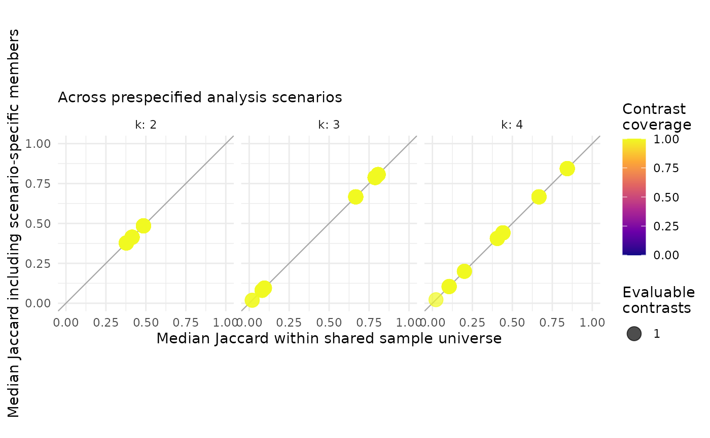

# Auditing a SOM ensemble without forcing classes

## The question comes before the class map

A self-organizing map can preserve an environmental gradient even when a
hard partition of its units is not reproducible. `SOMevidence` therefore
keeps four tasks separate:

1.  represent multivariate structure;
2.  audit mapping and topology;
3.  test candidate partitions across an ensemble; and
4.  make a conditional decision using requirements specified for the
    study.

The example uses simulated clusters so that the data-generating
structure is known. Real data never provide this kind of ground truth by
default.

``` r

library(SOMevidence)

set.seed(1)
dat <- simulate_som_scenario(
  "clusters", n = 90, p = 6, seed = 10,
  id = paste0("example_", seq_len(90))
)
dat
#> <som_data>
#>   samples: 90 
#>   layers : 1 
#>   id source: provided 
#>     - environment: 6 variables, 0.0% missing
#>   design : external_label
```

The simulated class label is stored only in metadata. It is not part of
the SOM input and is not used below.

## Preserve the sampling design

Rows are subsampled here because they are independent by construction.
For field surveys, `group_subsample`, `block_subsample` or
`leave_domain_out` should be used when sites, transects, individuals,
years or campaigns define the independent unit.

``` r

resamples <- som_resamples(
  dat,
  method = "subsample",
  repeats = 3,
  prop = 0.8,
  seed = 20
)

spec <- som_spec(
  grids = list(c(3, 2), c(4, 3)),
  seeds = c(30, 31),
  rlen = 40,
  k = 2:4
)
```

This creates 12 attempted models: three resamples, two grids and two
random initializations. Every transformation, mean and standard
deviation is learned from the analysis rows of its own split.

``` r

ensemble <- fit_som_ensemble(
  dat,
  spec,
  resamples,
  preprocess = som_preprocess("identity", center = TRUE, scale = TRUE)
)
ensemble
#> <som_ensemble>
#>   attempted: 12 
#>   succeeded: 12 
#>   failed   : 0 
#>   warnings : 0 
#>   samples  : 90
```

## Audit representation and partitions separately

``` r

audit <- audit_som(ensemble)
audit
#> <som_audit>
#>   successful fits: 12 
#>   success rate   : 100.0% 
#>   grids audited  : 2
audit$grid_summary
#>    grid xdim ydim n_fits median_quantization_error median_topographic_error
#> 1 3 x 2    3    2      6                  3.344689                0.2222222
#> 2 4 x 3    4    3      6                  2.257257                0.2916667
#>   median_empty_unit_rate
#> 1                      0
#> 2                      0

partitions <- partition_som(ensemble)
partitions
#> <som_partitions>
#>   fitted partitions : 36 
#>   candidate k       : 2, 3, 4 
#>   evidence scope    : analysis 
#>   pairwise contrasts: 198 
#>   agreement metric  : adjusted Rand index (not accuracy)
partitions$stability
#>   k    scope n_pairs n_partitions n_complete_partitions min_observed_clusters
#> 1 2 analysis      66           12                    12                     2
#> 2 3 analysis      66           12                    12                     3
#> 3 4 analysis      66           12                    12                     4
#>   n_pairs_evaluable median_joint_n median_joint_coverage median_ari    ari_q025
#> 1                66             58             0.6444444 0.07904953 -0.07647454
#> 2                66             58             0.6444444 0.31457897  0.09074610
#> 3                66             58             0.6444444 0.37472852  0.17858978
#>    ari_q975 median_ami    ami_q025  ami_q975
#> 1 0.7889482  0.1553512 -0.02331763 0.6984239
#> 2 0.6778272  0.3365075  0.18565508 0.6814412
#> 3 0.6634369  0.4193496  0.21635376 0.6839617

consensus <- consensus_som(partitions, k = 3)
consensus
#> <som_consensus>
#>   k                  : 3 
#>   method             : aligned_vote 
#>   evidence scope     : analysis 
#>   partitions         : 12 
#>   samples            : 90 
#>   assigned at least once: 90 
#>   assignment coverage: 1.000 
#>   consensus coverage : 1.000 
#>   consensus clusters : 3 / 3 
#>   replicated coverage: 1.000 
#>   median support     : 0.750 
#>   median entropy     : 0.512
consensus$cluster_summary
#>   cluster median_jaccard jaccard_q025 jaccard_q975
#> 1       1      0.5872865    0.3636364    0.9565217
#> 2       2      0.7198276    0.6129032    0.8928571
#> 3       3      0.5415282    0.1481481    0.8400000

references <- fit_cross_models(
  ensemble,
  methods = c("kmeans", "ward"),
  k = 2:4
)
comparison <- compare_cross_models(partitions, references)
comparison$summary
#>      scope method k n_comparisons median_ari    ari_q025  ari_q975 median_ami
#> 1 analysis kmeans 2            12 0.10169656 -0.03559160 0.7866490 0.21113188
#> 2 analysis   ward 2            12 0.01616664 -0.06841977 0.7859206 0.08871479
#> 3 analysis kmeans 3            12 0.45990535  0.16323005 0.7968555 0.49353972
#> 4 analysis   ward 3            12 0.41651517  0.09642750 0.6863293 0.43204196
#> 5 analysis kmeans 4            12 0.54891660  0.19152957 0.7251709 0.60803282
#> 6 analysis   ward 4            12 0.35888232  0.18877108 0.6942901 0.47017371
#>      ami_q025  ami_q975
#> 1 0.018744451 0.6750548
#> 2 0.001240258 0.7254310
#> 3 0.225046520 0.7683738
#> 4 0.181682547 0.6971771
#> 5 0.236738852 0.7331537
#> 6 0.289493696 0.7055366
```

Quantization error, topographic error and empty-unit rate describe
different properties of the representation. ARI describes agreement
between partitions; it is not classification accuracy and it does not
establish ecological truth.

Pareto selection retains candidates that are not dominated across the
stated criteria. It does not collapse the evidence into a weighted score
or a model leaderboard.

``` r

pareto_candidates(audit)
#>                           id      split_id grid_id xdim ydim seed
#> 1 subsample_001__g02_4x3_s31 subsample_001       2    4    3   31
#> 2 subsample_002__g02_4x3_s30 subsample_002       2    4    3   30
#> 3 subsample_002__g02_4x3_s31 subsample_002       2    4    3   31
#> 4 subsample_003__g01_3x2_s30 subsample_003       1    3    2   30
#> 5 subsample_003__g01_3x2_s31 subsample_003       1    3    2   31
#> 6 subsample_003__g02_4x3_s30 subsample_003       2    4    3   30
#>   quantization_error topographic_error empty_unit_rate pareto
#> 1           2.268676         0.2638889               0   TRUE
#> 2           2.236862         0.2916667               0   TRUE
#> 3           2.345579         0.2222222               0   TRUE
#> 4           3.455672         0.1250000               0   TRUE
#> 5           3.231768         0.1527778               0   TRUE
#> 6           2.133876         0.5555556               0   TRUE
```

## A conclusion may be withheld

Without a prespecified gate, the package reports that defensibility has
not been assessed.

``` r

assess_defensibility(audit, partitions, k = 3)
#> <som_defensibility>
#>   status: not_assessed 
#>   k     : 3
```

The following thresholds are deliberately permissive and serve only to
show the interface. They are not package defaults or general ecological
standards.

``` r

illustrative_gate <- som_gate(
  max_topographic_error = 0.5,
  max_empty_unit_rate = 0.5,
  min_median_ari = 0.2,
  min_success_rate = 0.95
)

assess_defensibility(
  audit,
  partitions,
  k = 3,
  gate = illustrative_gate,
  consensus = consensus,
  cross_model = comparison
)
#> <som_defensibility>
#>   status: supported 
#>   k     : 3 
#>   - all_cross_model_fits_succeeded: observed=1, threshold=1, pass
#>   - consensus_observes_k: observed=3, threshold=3, pass
#>   - all_partitions_observe_k: observed=1, threshold=1, pass
#>   - max_topographic_error: observed=0.264, threshold=0.5, pass
#>   - max_empty_unit_rate: observed=0, threshold=0.5, pass
#>   - min_median_ari: observed=0.315, threshold=0.2, pass
#>   - min_success_rate: observed=1, threshold=0.95, pass
```

A failed requirement yields `"abstain"`; unavailable evidence yields
`"uncertain"`. Passing an analyst-defined gate supports only the stated
partition under the stated analysis design. It does not convert an
unsupervised partition into a verified ecological type.

Because this simulation has known labels that were excluded from
training, we can compare them after the workflow. Real ecological
categories should not be treated as ground truth merely because they are
available.

``` r

evaluate_external_labels(consensus)
#> <som_external_assessment> (post hoc)
#>   samples used: 90 of 90 
#>   ARI         : 0.680 
#>   AMI         : 0.676 
#>   interpretation: agreement, not classification accuracy
```

## Governed real-data examples

[`open_data_registry()`](https://shaowen-ye.github.io/SOMevidence/reference/open_data_registry.md)
lists versioned datasets selected for distinct purposes in ecology,
environmental monitoring and evolution. The package never downloads
these data during installation or examples.

``` r

open_data_registry()[, c("id", "domain", "role", "license")]
#>                id      domain             role
#> 1 palmer_penguins   evolution       quickstart
#> 2  zirbel_prairie     ecology advanced_example
#> 3          cestes     ecology        benchmark
#> 4        nla_2022 environment advanced_example
#> 5    ant_ecomorph   evolution       validation
#> 6          avonet   evolution scale_validation
#>                               license
#> 1                             CC0-1.0
#> 2                             CC0-1.0
#> 3                             CC0-1.0
#> 4 No explicit licence in DOI metadata
#> 5                             CC0-1.0
#> 6                           CC BY 4.0
```

## Compare prespecified analysis choices on shared samples

[`run_som_sensitivity()`](https://shaowen-ye.github.io/SOMevidence/reference/run_som_sensitivity.md)
retains each evidence stream separately and also compares scenario
consensus labels on shared sample identifiers. A sample enters this
comparison only when at least two ensemble members assigned it in both
scenarios. The resulting ARI and AMI describe sensitivity to the stated
analysis choice; they are not accuracy measures. A second table asks
whether the set of observations clustered with each focal sample
persists across the same scenarios. The shared-universe Jaccard isolates
changes in the partition among jointly evaluable samples. The
all-members Jaccard also includes eligible members found in only one
scenario, so it combines coverage and repartitioning effects. Both are
label-invariant, require at least two jointly evaluable samples and need
no preferred reference scenario.

``` r

sensitivity <- run_som_sensitivity(
  list(
    standardized = list(data = dat, spec = spec),
    unscaled = list(
      data = dat,
      spec = spec,
      preprocess = som_preprocess(center = FALSE, scale = FALSE)
    )
  ),
  cross_models = "ward",
  keep_workflows = FALSE
)

sensitivity$scenario_comparison
#>     scenario_a scenario_b k n_shared n_replicated_a n_replicated_b n_joint
#> 1 standardized   unscaled 2       90             90             90      90
#> 2 standardized   unscaled 3       90             90             90      90
#> 3 standardized   unscaled 4       90             90             90      90
#>   joint_coverage        ari       ami comparison_status
#> 1              1 0.03442554 0.2249457         evaluated
#> 2              1 0.60479379 0.6039247         evaluated
#> 3              1 0.57210525 0.6221588         evaluated
head(sensitivity$sample_summary)
#>   k  sample_id n_scenarios n_contrasts n_comparable_contrasts
#> 1 2  example_1           2           1                      1
#> 2 2 example_10           2           1                      1
#> 3 2 example_11           2           1                      1
#> 4 2 example_12           2           1                      1
#> 5 2 example_13           2           1                      1
#> 6 2 example_14           2           1                      1
#>   n_possible_contrasts contrast_coverage conditional_contrast_coverage
#> 1                    1                 1                             1
#> 2                    1                 1                             1
#> 3                    1                 1                             1
#> 4                    1                 1                             1
#> 5                    1                 1                             1
#> 6                    1                 1                             1
#>   median_membership_jaccard_shared membership_jaccard_shared_q025
#> 1                        0.4848485                      0.4848485
#> 2                        0.4137931                      0.4137931
#> 3                        0.3777778                      0.3777778
#> 4                        0.3777778                      0.3777778
#> 5                        0.4137931                      0.4137931
#> 6                        0.3777778                      0.3777778
#>   membership_jaccard_shared_q975 min_membership_jaccard_shared
#> 1                      0.4848485                     0.4848485
#> 2                      0.4137931                     0.4137931
#> 3                      0.3777778                     0.3777778
#> 4                      0.3777778                     0.3777778
#> 5                      0.4137931                     0.4137931
#> 6                      0.3777778                     0.3777778
#>   median_membership_jaccard_all membership_jaccard_all_q025
#> 1                     0.4848485                   0.4848485
#> 2                     0.4137931                   0.4137931
#> 3                     0.3777778                   0.3777778
#> 4                     0.3777778                   0.3777778
#> 5                     0.4137931                   0.4137931
#> 6                     0.3777778                   0.3777778
#>   membership_jaccard_all_q975 min_membership_jaccard_all median_joint_n
#> 1                   0.4848485                  0.4848485             90
#> 2                   0.4137931                  0.4137931             90
#> 3                   0.3777778                  0.3777778             90
#> 4                   0.3777778                  0.3777778             90
#> 5                   0.4137931                  0.4137931             90
#> 6                   0.3777778                  0.3777778             90
plot(sensitivity)
```



`sample_summary` keeps the number and coverage of evaluable contrasts
beside both Jaccard summaries. `contrast_coverage` uses all prespecified
scenario pairs that requested the candidate `k`;
`conditional_contrast_coverage` uses only pairs for which global ARI/AMI
were evaluable. Low coverage is missing evidence, not stable membership.
Likewise, a large value is conditional on the prespecified scenarios and
must not be interpreted as a probability that the assignment is correct.
Set `sample_profiles = FALSE` when only global scenario comparisons are
needed for a very large scenario-by-sample design.

When scenarios contain different feature sets, row subsets or reordered
observations, supply stable `id` values (or explicit non-positional row
names) to
[`som_data()`](https://shaowen-ye.github.io/SOMevidence/reference/som_data.md).
Locally generated row numbers are not accepted as evidence that
observations match across different data objects. For any legacy
`som_data` object without `id_source`, rebuild the object with
`som_data(..., id = old$metadata$id)` to confirm that those identifiers
are intentional before comparing scenarios.
