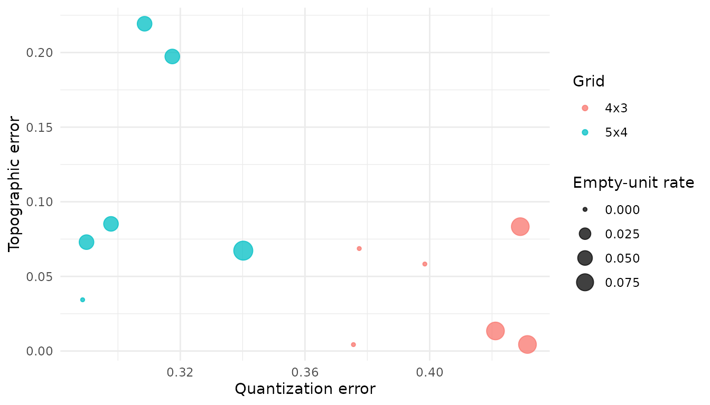
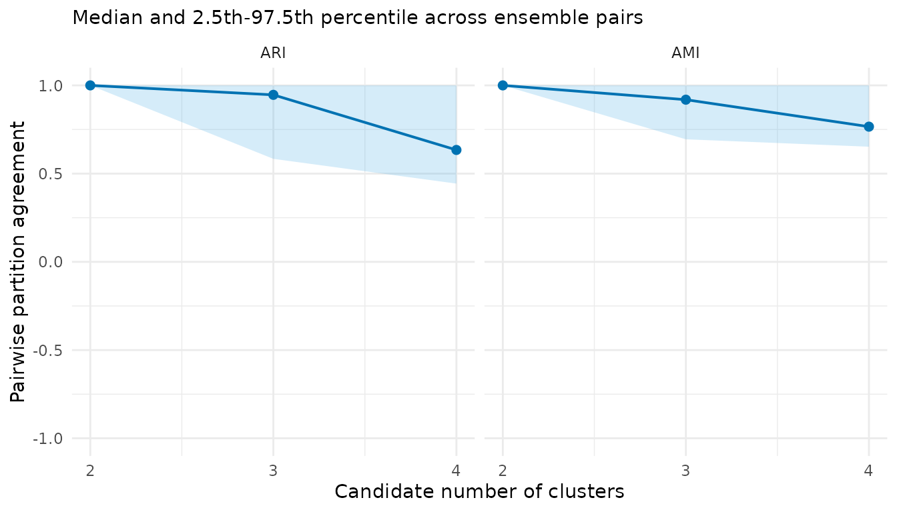
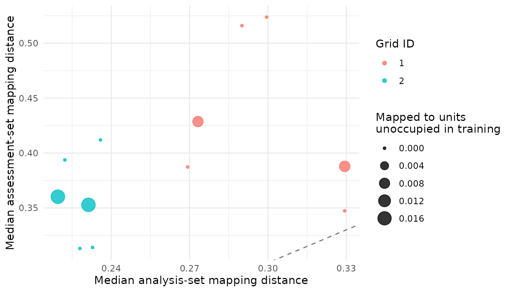

# A real-data audit of Palmer penguin morphology

## Purpose and inferential boundary

This tutorial uses an openly licensed, familiar dataset to show the
complete workflow on real observations. It does not claim that penguin
species are latent SOM classes or that morphology alone defines species.
The four morphological variables are used for unsupervised training.
Species is retained only as an external label and is inspected after the
ensemble and consensus partition have been constructed.

The data are distributed by the
[`palmerpenguins`](https://allisonhorst.github.io/palmerpenguins/)
package under CC0. Measurements were collected for Adelie, Chinstrap,
and Gentoo penguins in the Palmer Archipelago from 2007 to 2009. The
original data publication and source citations are provided by the data
package.

If the optional tutorial dependencies are unavailable, the code is
displayed but not evaluated when the vignette is built.

## Build a design-explicit data object

``` r

library(SOMevidence)

raw <- palmerpenguins::penguins
variables <- c(
  "bill_length_mm", "bill_depth_mm",
  "flipper_length_mm", "body_mass_g"
)
keep <- stats::complete.cases(raw[, c(variables, "species", "year")])
penguins <- raw[keep, , drop = FALSE]

morphology <- som_data(
  x = penguins[, variables],
  id = sprintf("penguin_%03d", seq_len(nrow(penguins))),
  time = penguins$year,
  domain = factor(penguins$year),
  external_label = penguins$species
)
morphology
#> <som_data>
#>   samples: 342 
#>   layers : 1 
#>   id source: provided 
#>     - data: 4 variables, 0.0% missing
#>   design : time, domain, external_label
```

Stable row identifiers make later joins auditable. Sampling year is
declared as a transfer domain. Species is stored in metadata and never
enters the SOM input matrix.

## Prespecify the transfer design and ensemble budget

Each split below leaves out one sampling year. The map and every
preprocessing quantity are fitted using the other years; observations
from the held-out year are assessment data. This demonstration uses a
small budget so that the vignette remains quick to build. A substantive
analysis should justify its grids, seeds, iterations, candidate `k`, and
transfer domains before fitting.

``` r

year_splits <- som_resamples(
  morphology,
  method = "leave_domain_out",
  domain = "domain"
)

spec <- som_spec(
  grids = list(c(4, 3), c(5, 4)),
  seeds = c(41, 42),
  rlen = 50,
  k = 2:4
)

year_splits
#> <som_resamples>
#>   method    : leave_domain_out 
#>   splits    : 3 
#>   unique analysis sets: 3 
#>   analysis  : 223-233 rows
#>   assessment: 109-119 rows
expand_som_spec(spec)
#>   xdim ydim grid_id seed    model_id
#> 1    4    3       1   41 g01_4x3_s41
#> 2    4    3       1   42 g01_4x3_s42
#> 3    5    4       2   41 g02_5x4_s41
#> 4    5    4       2   42 g02_5x4_s42
```

## Fit once and retain separate evidence streams

``` r

workflow <- run_som_workflow(
  morphology,
  spec,
  year_splits,
  preprocess = som_preprocess(center = TRUE, scale = TRUE),
  cross_models = c("kmeans", "ward")
)
workflow
#> <som_workflow>
#>   SOM fits      : 12 attempted; 12 succeeded; 0 failed; 0 warnings 
#>   candidate k   : 2, 3, 4 
#>   consensus     : 2 computed; 1 not_computed
#>     - k=2: computed; complete=yes; assignment=100.0%; labels=100.0%; replicated=100.0%
#>     - k=3: computed; complete=yes; assignment=100.0%; labels=100.0%; replicated=100.0%
#>     - k=4: not_computed
#>   cross-model   : 18 expected; 18 succeeded; 0 failed; 0 warnings ; 100.0% success
#>     - kmeans: 9 expected, 9 succeeded, 0 failed, 0 warnings, 100.0% success
#>     - ward: 9 expected, 9 succeeded, 0 failed, 0 warnings, 100.0% success
```

The representation audit, partition audit, consensus summaries,
cross-model comparison, and transfer audit answer different questions.
They should not be collapsed into a single rank.

``` r

workflow$audit$grid_summary
#>    grid xdim ydim n_fits median_quantization_error median_topographic_error
#> 1 4 x 3    4    3      6                 0.4097716               0.03587444
#> 2 5 x 4    5    4      6                 0.3031615               0.07908158
#>   median_empty_unit_rate
#> 1             0.04166667
#> 2             0.05000000
workflow$partitions$stability
#>   k    scope n_pairs n_partitions n_complete_partitions min_observed_clusters
#> 1 2 analysis      66           12                    12                     2
#> 2 3 analysis      66           12                    12                     3
#> 3 4 analysis      66           12                    12                     4
#>   n_pairs_evaluable median_joint_n median_joint_coverage median_ari  ari_q025
#> 1                66            119             0.3479532  1.0000000 1.0000000
#> 2                66            119             0.3479532  0.9464004 0.5837585
#> 3                66            119             0.3479532  0.6341304 0.4433956
#>   ari_q975 median_ami  ami_q025 ami_q975
#> 1        1  1.0000000 1.0000000        1
#> 2        1  0.9190143 0.6945523        1
#> 3        1  0.7661608 0.6524782        1
workflow$consensus$k3$cluster_summary
#>   cluster median_jaccard jaccard_q025 jaccard_q975
#> 1       1      0.9809524    0.5384615            1
#> 2       2      1.0000000    1.0000000            1
#> 3       3      0.9583333    0.4545455            1
workflow$cross_comparison$summary
#>      scope method k n_comparisons median_ari  ari_q025  ari_q975 median_ami
#> 1 analysis kmeans 2            12  1.0000000 1.0000000 1.0000000  1.0000000
#> 2 analysis   ward 2            12  1.0000000 1.0000000 1.0000000  1.0000000
#> 3 analysis kmeans 3            12  0.7893609 0.7108707 0.8804393  0.8086069
#> 4 analysis   ward 3            12  0.9646697 0.6203559 0.9876968  0.9441975
#> 5 analysis kmeans 4            12  0.6293081 0.5052421 0.7871324  0.7221508
#> 6 analysis   ward 4            12  0.9379016 0.4740153 0.9732182  0.9149813
#>    ami_q025  ami_q975
#> 1 1.0000000 1.0000000
#> 2 1.0000000 1.0000000
#> 3 0.7533403 0.8767339
#> 4 0.7233573 0.9774167
#> 5 0.6564826 0.8359577
#> 6 0.6512134 0.9682041

transfer <- audit_transfer(workflow$ensemble)
transfer$metrics
#>                                     id               split_id grid_id seed
#> 1  leave_domain_001_X2007__g01_4x3_s41 leave_domain_001_X2007       1   41
#> 2  leave_domain_001_X2007__g01_4x3_s42 leave_domain_001_X2007       1   42
#> 3  leave_domain_001_X2007__g02_5x4_s41 leave_domain_001_X2007       2   41
#> 4  leave_domain_001_X2007__g02_5x4_s42 leave_domain_001_X2007       2   42
#> 5  leave_domain_002_X2008__g01_4x3_s41 leave_domain_002_X2008       1   41
#> 6  leave_domain_002_X2008__g01_4x3_s42 leave_domain_002_X2008       1   42
#> 7  leave_domain_002_X2008__g02_5x4_s41 leave_domain_002_X2008       2   41
#> 8  leave_domain_002_X2008__g02_5x4_s42 leave_domain_002_X2008       2   42
#> 9  leave_domain_003_X2009__g01_4x3_s41 leave_domain_003_X2009       1   41
#> 10 leave_domain_003_X2009__g01_4x3_s42 leave_domain_003_X2009       1   42
#> 11 leave_domain_003_X2009__g02_5x4_s41 leave_domain_003_X2009       2   41
#> 12 leave_domain_003_X2009__g02_5x4_s42 leave_domain_003_X2009       2   42
#>    n_analysis n_assessment n_analysis_mapped n_assessment_mapped
#> 1         233          109               233                 109
#> 2         233          109               233                 109
#> 3         233          109               233                 109
#> 4         233          109               233                 109
#> 5         228          114               228                 114
#> 6         228          114               228                 114
#> 7         228          114               228                 114
#> 8         228          114               228                 114
#> 9         223          119               223                 119
#> 10        223          119               223                 119
#> 11        223          119               223                 119
#> 12        223          119               223                 119
#>    analysis_mapping_coverage assessment_mapping_coverage
#> 1                          1                           1
#> 2                          1                           1
#> 3                          1                           1
#> 4                          1                           1
#> 5                          1                           1
#> 6                          1                           1
#> 7                          1                           1
#> 8                          1                           1
#> 9                          1                           1
#> 10                         1                           1
#> 11                         1                           1
#> 12                         1                           1
#>    median_analysis_distance median_assessment_distance distance_ratio
#> 1                 0.2994931                  0.5238194       1.749020
#> 2                 0.2900610                  0.5160382       1.779068
#> 3                 0.2358949                  0.4119525       1.746339
#> 4                 0.2222224                  0.3937044       1.771669
#> 5                 0.3294059                  0.3878611       1.177456
#> 6                 0.3294059                  0.3473567       1.054494
#> 7                 0.2279949                  0.3130662       1.373128
#> 8                 0.2328458                  0.3139906       1.348492
#> 9                 0.2692782                  0.3872812       1.438220
#> 10                0.2732061                  0.4286799       1.569072
#> 11                0.2195664                  0.3602205       1.640599
#> 12                0.2312665                  0.3528038       1.525529
#>    unoccupied_unit_rate
#> 1           0.000000000
#> 2           0.000000000
#> 3           0.000000000
#> 4           0.000000000
#> 5           0.008771930
#> 6           0.000000000
#> 7           0.000000000
#> 8           0.000000000
#> 9           0.000000000
#> 10          0.008403361
#> 11          0.016806723
#> 12          0.016806723
```

``` r

plot(workflow$audit)
```



``` r

plot(workflow$partitions)
```



``` r

plot(transfer)
```



Quantization and topographic errors concern the SOM representation. ARI
and AMI between SOM and reference partitions concern agreement under a
shared analysis design. Held-year distance and occupancy diagnostics
concern transfer. None of these quantities is classification accuracy.

## Inspect external labels only after consensus

For illustration, inspect `k = 3` because the dataset contains three
recorded species. This is a prespecified teaching choice, not evidence
that `k = 3` is the optimal unsupervised partition.

``` r

consensus_k3 <- workflow$consensus$k3
external <- evaluate_external_labels(consensus_k3)
external
#> <som_external_assessment> (post hoc)
#>   samples used: 342 of 342 
#>   ARI         : 0.938 
#>   AMI         : 0.912 
#>   interpretation: agreement, not classification accuracy
external$contingency
#>                  external_label
#> consensus_cluster Adelie Chinstrap Gentoo
#>                 1    150         7      0
#>                 2      0         0    123
#>                 3      1        61      0
external$composition
#>   consensus_cluster external_label   n within_cluster_proportion
#> 1                 1         Adelie 150                0.95541401
#> 2                 2         Adelie   0                0.00000000
#> 3                 3         Adelie   1                0.01612903
#> 4                 1      Chinstrap   7                0.04458599
#> 5                 2      Chinstrap   0                0.00000000
#> 6                 3      Chinstrap  61                0.98387097
#> 7                 1         Gentoo   0                0.00000000
#> 8                 2         Gentoo 123                1.00000000
#> 9                 3         Gentoo   0                0.00000000
```

The resulting ARI, AMI, and contingency table describe agreement between
one consensus partition and the recorded species labels among evaluable
samples. They do not establish that the partition is biologically
correct, and they do not validate the package. The example instead
demonstrates how labels can be kept outside training and introduced
transparently at the interpretation stage.

## Reproducibility record

Archive the package version, software environment, input provenance, and
exact analysis choices with any reported result.

``` r

packageVersion("SOMevidence")
#> [1] '1.1.3'
packageVersion("palmerpenguins")
#> [1] '0.1.1'
sessionInfo()
#> R version 4.6.1 (2026-06-24)
#> Platform: x86_64-pc-linux-gnu
#> Running under: Ubuntu 24.04.4 LTS
#> 
#> Matrix products: default
#> BLAS:   /usr/lib/x86_64-linux-gnu/openblas-pthread/libblas.so.3 
#> LAPACK: /usr/lib/x86_64-linux-gnu/openblas-pthread/libopenblasp-r0.3.26.so;  LAPACK version 3.12.0
#> 
#> locale:
#>  [1] LC_CTYPE=C.UTF-8       LC_NUMERIC=C           LC_TIME=C.UTF-8       
#>  [4] LC_COLLATE=C.UTF-8     LC_MONETARY=C.UTF-8    LC_MESSAGES=C.UTF-8   
#>  [7] LC_PAPER=C.UTF-8       LC_NAME=C              LC_ADDRESS=C          
#> [10] LC_TELEPHONE=C         LC_MEASUREMENT=C.UTF-8 LC_IDENTIFICATION=C   
#> 
#> time zone: UTC
#> tzcode source: system (glibc)
#> 
#> attached base packages:
#> [1] stats     graphics  grDevices utils     datasets  methods   base     
#> 
#> other attached packages:
#> [1] SOMevidence_1.1.3
#> 
#> loaded via a namespace (and not attached):
#>  [1] gtable_0.3.6         jsonlite_2.0.0       kohonen_3.0.13      
#>  [4] compiler_4.6.1       Rcpp_1.1.2           cluster_2.1.8.2     
#>  [7] jquerylib_0.1.4      systemfonts_1.3.2    scales_1.4.0        
#> [10] textshaping_1.0.5    yaml_2.3.12          fastmap_1.2.0       
#> [13] ggplot2_4.0.3        R6_2.6.1             labeling_0.4.3      
#> [16] knitr_1.51           palmerpenguins_0.1.1 tibble_3.3.1        
#> [19] desc_1.4.3           bslib_0.12.0         pillar_1.11.1       
#> [22] RColorBrewer_1.1-3   rlang_1.3.0          cachem_1.1.0        
#> [25] xfun_0.60            fs_2.1.0             sass_0.4.10         
#> [28] S7_0.2.2             otel_0.2.0           cli_3.6.6           
#> [31] pkgdown_2.2.1        withr_3.0.3          magrittr_2.0.5      
#> [34] digest_0.6.39        grid_4.6.1           lifecycle_1.0.5     
#> [37] clue_0.3-68          vctrs_0.7.3          evaluate_1.0.5      
#> [40] glue_1.8.1           farver_2.1.2         ragg_1.5.2          
#> [43] rmarkdown_2.31       tools_4.6.1          pkgconfig_2.0.3     
#> [46] htmltools_0.5.9
```
