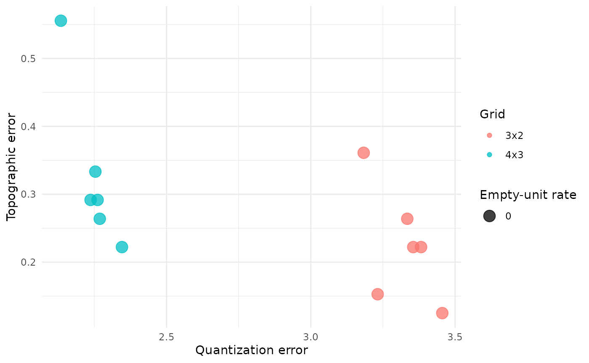
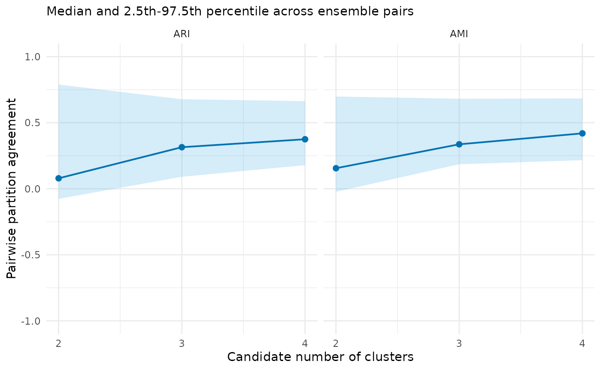
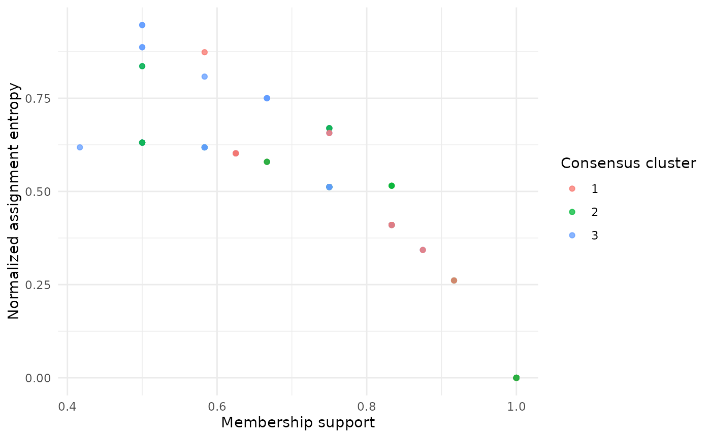
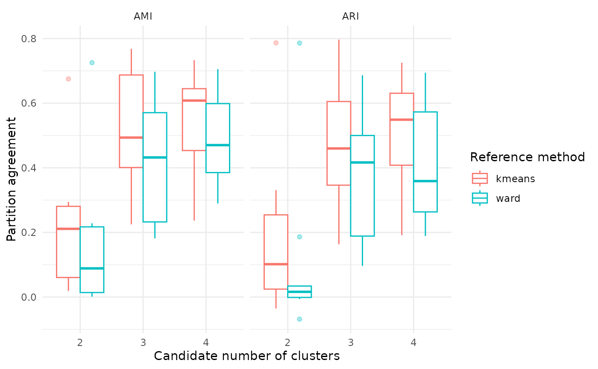

# Start here: a complete SOM evidence workflow

## What this example does

This is the shortest complete route through `SOMevidence`. We will:

1.  prepare data and a resampling design;
2.  fit a small SOM ensemble;
3.  inspect the map and candidate partitions; and
4.  compare the SOM partitions with two reference methods.

The example uses simulated classes, so we know how the data were
generated. With field data, the underlying groups are unknown. A stable
partition is evidence worth reporting, but it is not proof of an
ecological type.

``` r

library(SOMevidence)

dat <- simulate_som_scenario(
  "clusters",
  n = 90,
  p = 6,
  seed = 10,
  id = paste0("example_", seq_len(90))
)
dat
#> <som_data>
#>   samples: 90 
#>   layers : 1 
#>   id source: provided 
#>     - environment: 6 variables, 0.0% missing
#>   design : external_label
```

The simulated class label is stored in metadata. It does not enter the
SOM training matrix.

## Describe the analysis before fitting

Rows are independent in this simulation, so ordinary subsampling is
suitable. For repeated observations from sites, individuals or
transects, resample whole groups instead. See the resampling tutorial
for worked examples.

``` r

resamples <- som_resamples(
  dat,
  method = "subsample",
  repeats = 3,
  prop = 0.8,
  seed = 20
)

spec <- som_spec(
  grids = list(c(3, 2), c(4, 3)),
  seeds = c(30, 31),
  rlen = 40,
  k = 2:4
)
```

This design attempts 12 SOM fits: three subsamples, two grids and two
random starts. The small budget keeps the example quick. It is not a
default for a research analysis.

## Run the workflow

``` r

workflow <- run_som_workflow(
  dat,
  spec,
  resamples,
  preprocess = som_preprocess(
    "identity",
    center = TRUE,
    scale = TRUE
  ),
  cross_models = c("kmeans", "ward")
)
workflow
#> <som_workflow>
#>   SOM fits      : 12 attempted; 12 succeeded; 0 failed; 0 warnings 
#>   candidate k   : 2, 3, 4 
#>   consensus     : 3 computed; 0 not_computed
#>     - k=2: computed; complete=yes; assignment=100.0%; labels=100.0%; replicated=100.0%
#>     - k=3: computed; complete=yes; assignment=100.0%; labels=100.0%; replicated=100.0%
#>     - k=4: computed; complete=yes; assignment=100.0%; labels=100.0%; replicated=100.0%
#>   cross-model   : 18 expected; 18 succeeded; 0 failed; 0 warnings ; 100.0% success
#>     - kmeans: 9 expected, 9 succeeded, 0 failed, 0 warnings, 100.0% success
#>     - ward: 9 expected, 9 succeeded, 0 failed, 0 warnings, 100.0% success
summary(workflow)
#> <summary.som_workflow>
#>   SOM success: 12 / 12 
#>   consensus  : 3 computed; 0 not_computed
#>     - k=2: computed; complete=yes; assignment=100.0%; labels=100.0%; replicated=100.0%
#>     - k=3: computed; complete=yes; assignment=100.0%; labels=100.0%; replicated=100.0%
#>     - k=4: computed; complete=yes; assignment=100.0%; labels=100.0%; replicated=100.0%
#>   reference methods:
#>     - kmeans: 9 expected, 9 succeeded, 0 failed, 0 warnings, 100.0% success
#>     - ward: 9 expected, 9 succeeded, 0 failed, 0 warnings, 100.0% success
```

Preprocessing is learned within each subsample. Assessment rows
therefore do not influence the means or standard deviations used for
training.

## Read the results in order

Start with fit success and map diagnostics.

``` r

workflow$audit$grid_summary
#>    grid xdim ydim n_fits median_quantization_error median_topographic_error
#> 1 3 x 2    3    2      6                  3.344689                0.2222222
#> 2 4 x 3    4    3      6                  2.257257                0.2916667
#>   median_empty_unit_rate
#> 1                      0
#> 2                      0
plot(workflow$audit)
```



Quantization error, topographic error and empty-unit rate describe the
map. None of them tells us whether a hard partition is reproducible.

Next, inspect the candidate values of `k`.

``` r

workflow$partitions$stability
#>   k    scope n_pairs n_partitions n_complete_partitions min_observed_clusters
#> 1 2 analysis      66           12                    12                     2
#> 2 3 analysis      66           12                    12                     3
#> 3 4 analysis      66           12                    12                     4
#>   n_pairs_evaluable median_joint_n median_joint_coverage median_ari    ari_q025
#> 1                66             58             0.6444444 0.07904953 -0.07647454
#> 2                66             58             0.6444444 0.31457897  0.09074610
#> 3                66             58             0.6444444 0.37472852  0.17858978
#>    ari_q975 median_ami    ami_q025  ami_q975
#> 1 0.7889482  0.1553512 -0.02331763 0.6984239
#> 2 0.6778272  0.3365075  0.18565508 0.6814412
#> 3 0.6634369  0.4193496  0.21635376 0.6839617
plot(workflow$partitions)
```



ARI and AMI measure agreement among repeated partitions. They are not
classification accuracy. Read them together with the number of
successful fits and the joint sample coverage.

Now look at sample-level support for one prespecified candidate. We use
`k = 3` because this teaching simulation has three generated classes.

``` r

consensus_k3 <- workflow$consensus$k3
consensus_k3$cluster_summary
#>   cluster median_jaccard jaccard_q025 jaccard_q975
#> 1       1      0.5872865    0.3636364    0.9565217
#> 2       2      0.7198276    0.6129032    0.8928571
#> 3       3      0.5415282    0.1481481    0.8400000
plot(consensus_k3)
```



Low support or high assignment entropy points to uncertain membership. A
consensus label is a summary of repeated assignments, not a probability
that the label is correct.

Finally, compare the SOM partition with K-means and Ward.D2 on the same
eligible analysis splits.

``` r

workflow$cross_comparison$summary
#>      scope method k n_comparisons median_ari    ari_q025  ari_q975 median_ami
#> 1 analysis kmeans 2            12 0.10169656 -0.03559160 0.7866490 0.21113188
#> 2 analysis   ward 2            12 0.01616664 -0.06841977 0.7859206 0.08871479
#> 3 analysis kmeans 3            12 0.45990535  0.16323005 0.7968555 0.49353972
#> 4 analysis   ward 3            12 0.41651517  0.09642750 0.6863293 0.43204196
#> 5 analysis kmeans 4            12 0.54891660  0.19152957 0.7251709 0.60803282
#> 6 analysis   ward 4            12 0.35888232  0.18877108 0.6942901 0.47017371
#>      ami_q025  ami_q975
#> 1 0.018744451 0.6750548
#> 2 0.001240258 0.7254310
#> 3 0.225046520 0.7683738
#> 4 0.181682547 0.6971771
#> 5 0.236738852 0.7331537
#> 6 0.289493696 0.7055366
plot(workflow$cross_comparison)
```



Cross-model agreement is useful triangulation. It should not be turned
into a model ranking.

## Use known labels only after fitting

Because this is a simulation, we can compare the `k = 3` consensus with
the generated labels. Those labels were not used for training.

``` r

evaluate_external_labels(consensus_k3)
#> <som_external_assessment> (post hoc)
#>   samples used: 90 of 90 
#>   label match : stored 
#>   ARI         : 0.680 
#>   AMI         : 0.676 
#>   interpretation: agreement, not classification accuracy
```

In a field study, a recorded category may itself be uncertain or answer
a different biological question. Treat it as external evidence, not
automatic ground truth.

## What to save

Keep the following with any reported analysis:

- the input data and their provenance;
- stable sample identifiers and the sampling design;
- transformations, grids, seeds, iterations and candidate `k` values;
- warnings, failed fits and all evidence tables; and
- the package version and R session information.

``` r

packageVersion("SOMevidence")
#> [1] '1.2.1'
sessionInfo()
#> R version 4.6.1 (2026-06-24)
#> Platform: x86_64-pc-linux-gnu
#> Running under: Ubuntu 24.04.4 LTS
#> 
#> Matrix products: default
#> BLAS:   /usr/lib/x86_64-linux-gnu/openblas-pthread/libblas.so.3 
#> LAPACK: /usr/lib/x86_64-linux-gnu/openblas-pthread/libopenblasp-r0.3.26.so;  LAPACK version 3.12.0
#> 
#> locale:
#>  [1] LC_CTYPE=C.UTF-8       LC_NUMERIC=C           LC_TIME=C.UTF-8       
#>  [4] LC_COLLATE=C.UTF-8     LC_MONETARY=C.UTF-8    LC_MESSAGES=C.UTF-8   
#>  [7] LC_PAPER=C.UTF-8       LC_NAME=C              LC_ADDRESS=C          
#> [10] LC_TELEPHONE=C         LC_MEASUREMENT=C.UTF-8 LC_IDENTIFICATION=C   
#> 
#> time zone: UTC
#> tzcode source: system (glibc)
#> 
#> attached base packages:
#> [1] stats     graphics  grDevices utils     datasets  methods   base     
#> 
#> other attached packages:
#> [1] SOMevidence_1.2.1
#> 
#> loaded via a namespace (and not attached):
#>  [1] vctrs_0.7.3        cli_3.6.6          knitr_1.51         rlang_1.3.0       
#>  [5] xfun_0.60          otel_0.2.0         S7_0.2.2           textshaping_1.0.5 
#>  [9] clue_0.3-68        jsonlite_2.0.0     labeling_0.4.3     glue_1.8.1        
#> [13] htmltools_0.5.9    ragg_1.5.2         sass_0.4.10        scales_1.4.0      
#> [17] rmarkdown_2.31     grid_4.6.1         evaluate_1.0.5     jquerylib_0.1.4   
#> [21] fastmap_1.2.0      yaml_2.3.12        lifecycle_1.0.5    cluster_2.1.8.2   
#> [25] compiler_4.6.1     kohonen_3.0.13     RColorBrewer_1.1-3 fs_2.1.0          
#> [29] Rcpp_1.1.2         farver_2.1.2       systemfonts_1.3.2  digest_0.6.39     
#> [33] R6_2.6.1           bslib_0.12.0       gtable_0.3.6       tools_4.6.1       
#> [37] withr_3.0.3        ggplot2_4.0.3      pkgdown_2.2.1      cachem_1.1.0      
#> [41] desc_1.4.3
```

Next, use the guided Shiny tutorial for an interactive introduction or
the resampling tutorial to match the workflow to a real monitoring
design.
