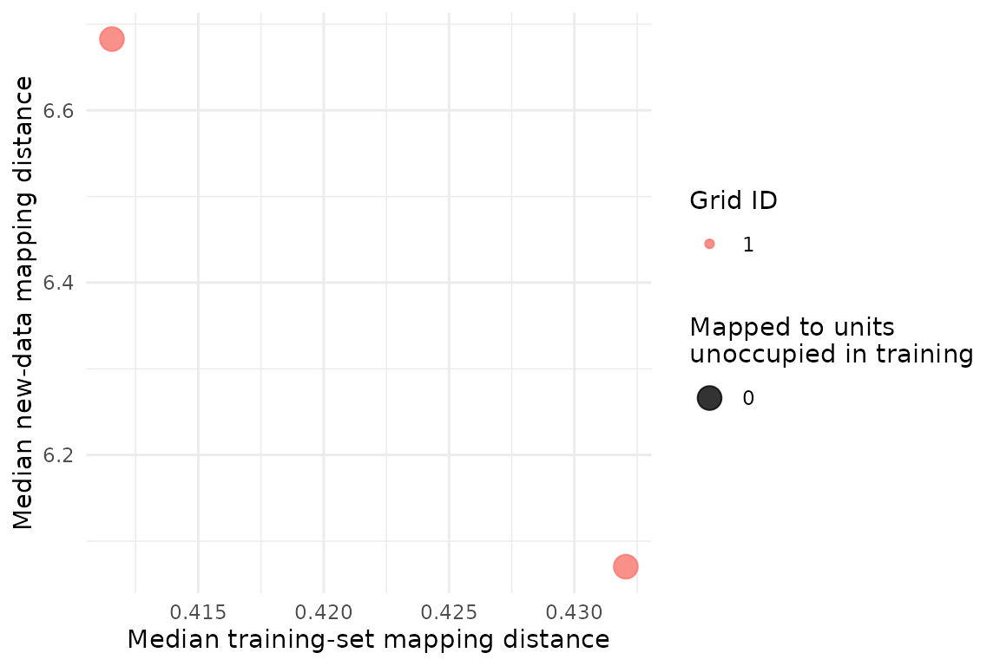

# Choose the right resampling unit

## Why rows are not always independent

Monitoring tables often contain several records from the same site,
individual, transect or campaign. If we split those rows independently,
closely related records can appear in both the analysis and assessment
sets. The partition may then look more reproducible than it is for a new
sampling unit.

The solution is simple: resample the unit that was independently
sampled.

## Compare row and site resampling

The example below creates repeated observations within 20 simulated
sites. Generated class labels are stored as metadata and are not used
for training.

``` r

library(SOMevidence)

grouped <- simulate_som_scenario(
  "grouped_pseudoreplication",
  n = 120,
  p = 6,
  n_groups = 20,
  group_icc = 0.7,
  seed = 101
)
grouped
#> <som_data>
#>   samples: 120 
#>   layers : 1 
#>   id source: generated 
#>     - environment: 6 variables, 0.0% missing
#>   design : group, external_label
```

We now create two designs. The first samples rows. The second samples
whole sites.

``` r

row_splits <- som_resamples(
  grouped,
  method = "subsample",
  repeats = 3,
  prop = 0.8,
  seed = 102
)

site_splits <- som_resamples(
  grouped,
  method = "group_subsample",
  repeats = 3,
  prop = 0.8,
  seed = 102
)

spec <- som_spec(
  grids = list(c(3, 2), c(4, 3)),
  seeds = c(103, 104),
  rlen = 40,
  k = 2:4
)
```

Only the resampling unit changes.

``` r

row_result <- run_som_workflow(
  grouped,
  spec,
  row_splits,
  cross_models = c("kmeans", "ward")
)

site_result <- run_som_workflow(
  grouped,
  spec,
  site_splits,
  cross_models = c("kmeans", "ward")
)

row_result$partitions$stability
#>   k    scope n_pairs n_partitions n_complete_partitions min_observed_clusters
#> 1 2 analysis      66           12                    12                     2
#> 2 3 analysis      66           12                    12                     3
#> 3 4 analysis      66           12                    12                     4
#>   n_pairs_evaluable median_joint_n median_joint_coverage median_ari    ari_q025
#> 1                66             77             0.6416667  0.8422883 -0.08694017
#> 2                66             77             0.6416667  0.2107658  0.04482264
#> 3                66             77             0.6416667  0.4163832  0.20542576
#>    ari_q975 median_ami   ami_q025  ami_q975
#> 1 1.0000000  0.7334836 0.03327869 1.0000000
#> 2 0.7498954  0.4276810 0.21301548 0.7199418
#> 3 0.7331367  0.5598854 0.35534372 0.7290238
site_result$partitions$stability
#>   k    scope n_pairs n_partitions n_complete_partitions min_observed_clusters
#> 1 2 analysis      66           12                    12                     2
#> 2 3 analysis      66           12                    12                     3
#> 3 4 analysis      66           12                    12                     4
#>   n_pairs_evaluable median_joint_n median_joint_coverage median_ari  ari_q025
#> 1                66             78                  0.65  0.7010256 0.0162294
#> 2                66             78                  0.65  0.3515673 0.1008049
#> 3                66             78                  0.65  0.2987112 0.1011727
#>    ari_q975 median_ami   ami_q025  ami_q975
#> 1 0.9330339  0.5757283 0.03367107 0.8662455
#> 2 0.7344795  0.4014499 0.18533753 0.6936857
#> 3 0.7106070  0.4090858 0.27542202 0.6681121
```

Treat this as a design sensitivity, not a competition between
algorithms. If the results differ, the sampling hierarchy matters. The
field design tells you which result answers the scientific question.

## Leave out a monitoring domain

Sometimes the question is not about new sites within the same survey. We
may want to know how a map behaves in a different season, region,
campaign or instrument domain.

``` r

shifted <- simulate_som_scenario(
  "gradient",
  n = 120,
  p = 6,
  n_domains = 3,
  domain_shift = 1,
  seed = 110
)

domain_splits <- som_resamples(
  shifted,
  method = "leave_domain_out",
  domain = "domain"
)

domain_ensemble <- fit_som_ensemble(
  shifted,
  som_spec(
    c(4, 3),
    seeds = c(111, 112),
    rlen = 40,
    k = 2:4
  ),
  domain_splits
)

transfer <- audit_transfer(domain_ensemble)
transfer$metrics
#>                                         id                   split_id grid_id
#> 1 leave_domain_001_domain_01__g01_4x3_s111 leave_domain_001_domain_01       1
#> 2 leave_domain_001_domain_01__g01_4x3_s112 leave_domain_001_domain_01       1
#> 3 leave_domain_002_domain_02__g01_4x3_s111 leave_domain_002_domain_02       1
#> 4 leave_domain_002_domain_02__g01_4x3_s112 leave_domain_002_domain_02       1
#> 5 leave_domain_003_domain_03__g01_4x3_s111 leave_domain_003_domain_03       1
#> 6 leave_domain_003_domain_03__g01_4x3_s112 leave_domain_003_domain_03       1
#>   seed n_analysis n_assessment n_analysis_mapped n_assessment_mapped
#> 1  111         80           40                80                  40
#> 2  112         80           40                80                  40
#> 3  111         80           40                80                  40
#> 4  112         80           40                80                  40
#> 5  111         80           40                80                  40
#> 6  112         80           40                80                  40
#>   analysis_mapping_coverage assessment_mapping_coverage
#> 1                         1                           1
#> 2                         1                           1
#> 3                         1                           1
#> 4                         1                           1
#> 5                         1                           1
#> 6                         1                           1
#>   median_analysis_distance median_assessment_distance distance_ratio
#> 1                0.5418000                  9.2082891      16.995735
#> 2                0.5106895                  9.2082891      18.031090
#> 3                0.1773180                  0.4040655       2.278761
#> 4                0.1516422                  0.3734101       2.462442
#> 5                0.4320523                  6.0703721      14.050085
#> 6                0.4115560                  6.6826979      16.237638
#>   unoccupied_unit_rate
#> 1                0.000
#> 2                0.000
#> 3                0.875
#> 4                0.850
#> 5                0.000
#> 6                0.000
```

``` r

plot(transfer)
```


The distance and occupancy measures show whether the held-out domain
maps like the training data. They are not accuracy measures. This
simulation mixes range extrapolation with an added domain shift, so it
also cannot identify a causal mechanism.

## Map a later batch without refitting

An operational workflow may freeze an ensemble and map a later batch.
The new data need the same named layers and variables. Each map reuses
the preprocessing learned from its own training data.

``` r

training_rows <- shifted$metadata$domain != "domain_03"

training <- som_data(
  layers = lapply(
    shifted$layers,
    function(x) x[training_rows, , drop = FALSE]
  ),
  id = shifted$metadata$id[training_rows]
)

new_batch <- som_data(
  layers = lapply(
    shifted$layers,
    function(x) x[!training_rows, , drop = FALSE]
  ),
  id = shifted$metadata$id[!training_rows],
  domain = shifted$metadata$domain[!training_rows]
)

frozen_ensemble <- fit_som_ensemble(
  training,
  som_spec(
    c(4, 3),
    seeds = c(120, 121),
    rlen = 40,
    k = 2:4
  ),
  keep_models = TRUE
)

new_mapping <- map_som_ensemble(frozen_ensemble, new_batch)
new_mapping$summary
#>               fit_id grid_id xdim ydim n_new n_mapped mapping_coverage
#> 1 full__g01_4x3_s120       1    4    3    40       40                1
#> 2 full__g01_4x3_s121       1    4    3    40       40                1
#>   median_training_distance median_new_distance distance_ratio
#> 1                0.4320523            6.070372       14.05008
#> 2                0.4115560            6.682698       16.23764
#>   unoccupied_unit_rate
#> 1                    0
#> 2                    0
```

``` r

plot(new_mapping)
```



Best-matching unit numbers belong to a specific fitted map. Do not
compare a node number across different grids as if it were the same
class.

## Define time or space blocks yourself

Use `block_subsample` when the study design already defines seasons,
campaigns, reaches or time windows. Pass those blocks through `unit`.
The package does not guess a block length from row order.

The practical rule is: identify the independent sampling unit first,
then choose the resampling method.
