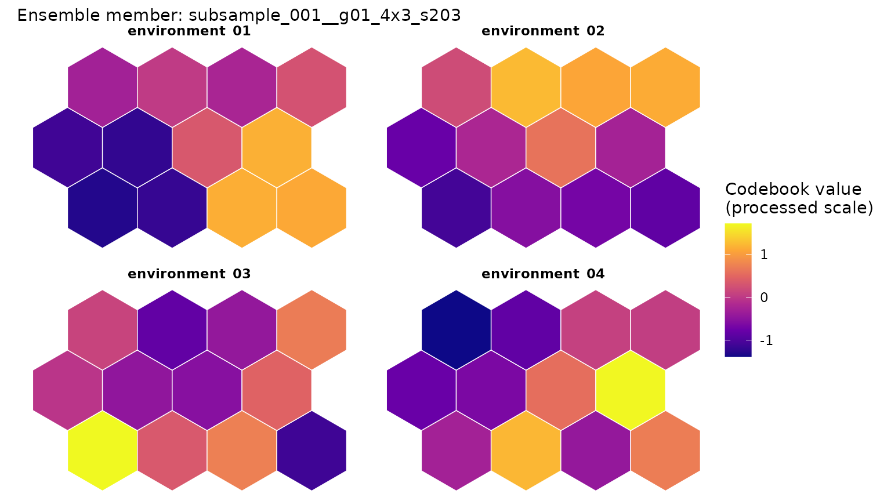
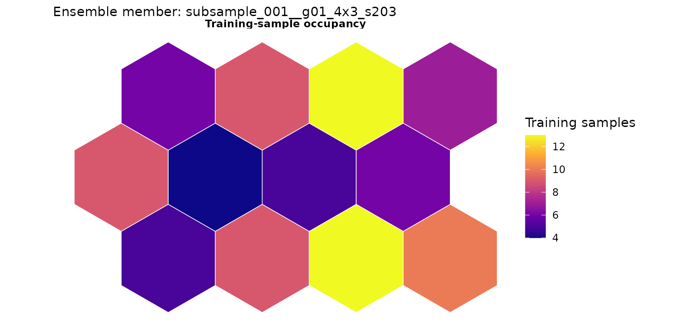
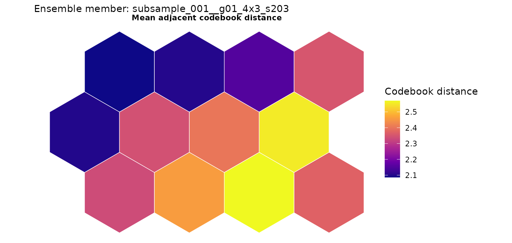
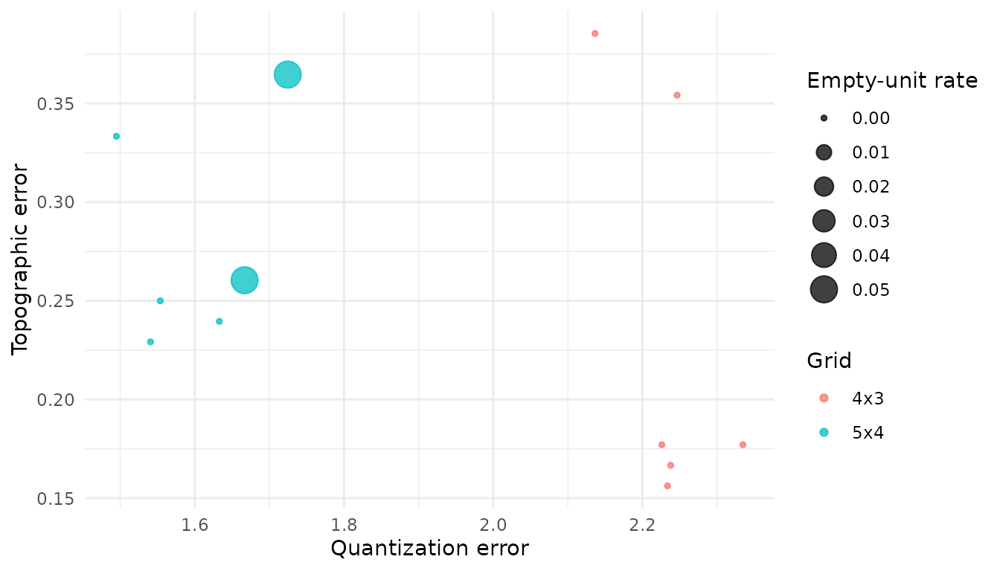
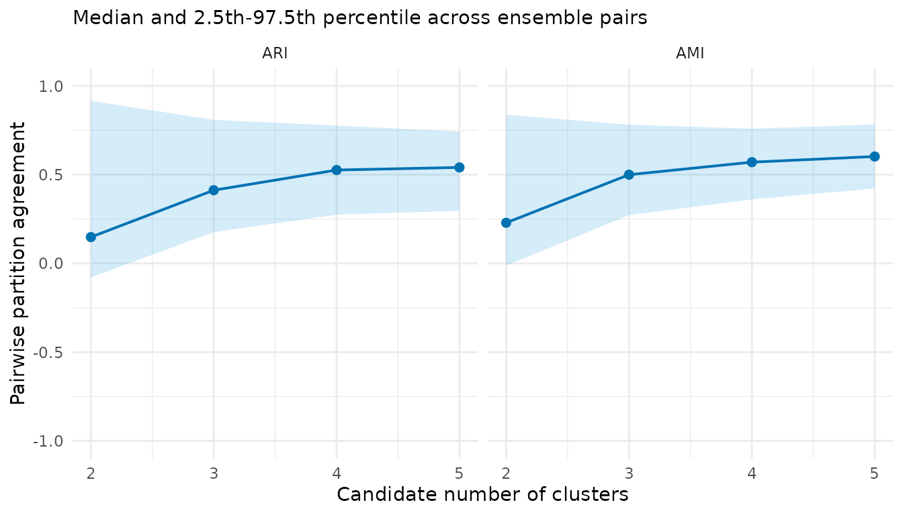
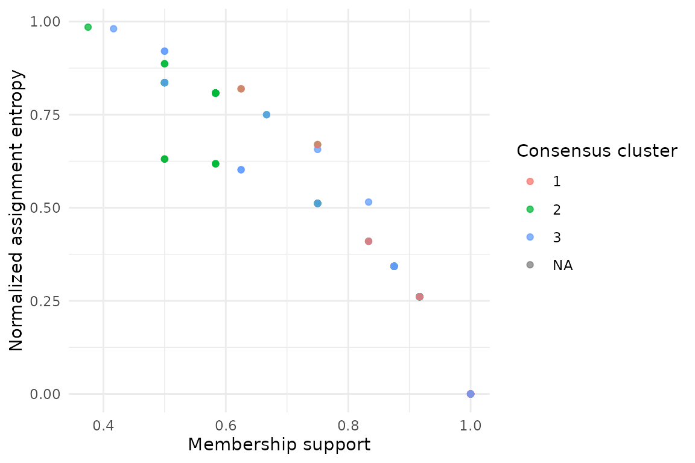

# Read the maps and uncertainty plots

## Fit a small example

A component plane shows one fitted map. It cannot show how much the
result changes across resampled data, grid sizes and random starts. We
therefore read the map together with the ensemble plots.

``` r

library(SOMevidence)

dat <- simulate_som_scenario(
  "clusters",
  n = 120,
  p = 6,
  seed = 201
)

resamples <- som_resamples(
  dat,
  method = "subsample",
  repeats = 3,
  seed = 202
)

spec <- som_spec(
  grids = list(c(4, 3), c(5, 4)),
  seeds = c(203, 204),
  rlen = 50,
  k = 2:5
)

workflow <- run_som_workflow(
  dat,
  spec,
  resamples,
  cross_models = c("kmeans", "ward")
)

fit_id <- workflow$ensemble$fits[[1]]$id
```

## Look at one map

``` r

plot_som_plane(
  workflow$ensemble,
  fit_id = fit_id,
  variables = colnames(dat$layers$environment)[1:4]
)
```



The colours show codebook values after the preprocessing used for this
fit. The subtitle identifies the ensemble member. If more than one map
is available, `fit_id` is required so that the displayed map is
unambiguous.

Two companion views help explain the map:

``` r

plot_som_plane(
  workflow$ensemble,
  type = "occupancy",
  fit_id = fit_id
)
```



``` r


plot_som_plane(
  workflow$ensemble,
  type = "neighbour_distance",
  fit_id = fit_id
)
```



Occupancy shows how many observations use each map unit. Neighbour
distance shows changes between adjacent codebook vectors. Neither view
tells us whether a hard classification is stable.

## Put ensemble evidence beside the map

``` r

plot(workflow$audit)
```



``` r

plot(workflow$partitions)
```



The first plot summarizes representation diagnostics and fit success.
The second shows how candidate partitions vary across the ensemble. Read
the displayed intervals and coverage rather than choosing a result from
colour or visual separation alone.

## Find uncertain samples

``` r

consensus_k3 <- workflow$consensus$k3
plot(consensus_k3)
#> Warning: Removed 3 rows containing missing values or values outside the scale range
#> (`geom_point()`).
```



``` r

consensus_k3$cluster_summary
#>   cluster median_jaccard jaccard_q025 jaccard_q975
#> 1       1      0.8573589    0.4310345    0.9677419
#> 2       2      0.5827922    0.3043478    0.9166667
#> 3       3      0.6866071    0.3921569    0.8285714
```

Membership support and assignment entropy show where the repeated fits
agree and where they do not. A consensus label is still conditional on
the chosen data, preprocessing, ensemble and `k`.

## Compare reference methods

``` r

plot(workflow$cross_comparison)
```


This plot shows agreement with the prespecified reference methods. It
does not rank the methods or turn agreement into accuracy.

For a report, keep at least three views together: one clearly identified
map, the ensemble representation diagnostics and the partition or
consensus evidence. This is more informative than a single attractive
SOM figure.
