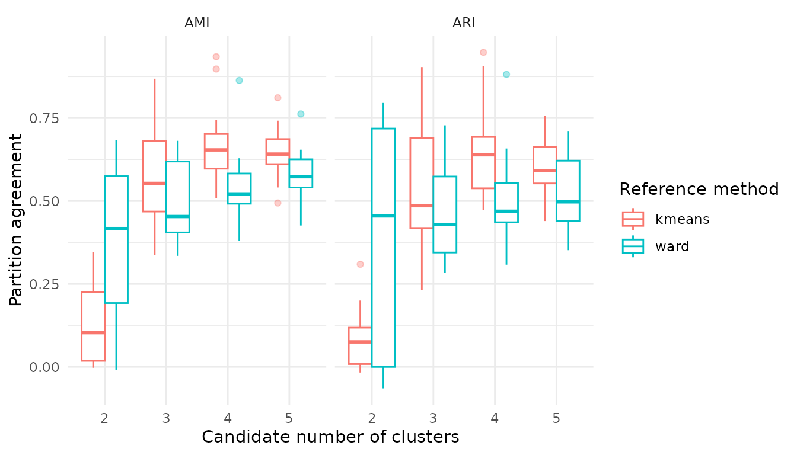

# Visualizing SOM structure and uncertainty

## A map is one member of an ensemble

Component planes are useful for interpreting a fitted self-organizing
map, but one visually appealing map cannot represent variation across
grids, random starts and resampled data. `SOMevidence` therefore
identifies the exact ensemble member in every map subtitle and requires
`fit_id` whenever more than one successful map is available.

``` r

library(SOMevidence)

dat <- simulate_som_scenario("clusters", n = 120, p = 6, seed = 201)
resamples <- som_resamples(dat, method = "subsample", repeats = 3, seed = 202)
spec <- som_spec(
  grids = list(c(4, 3), c(5, 4)),
  seeds = c(203, 204),
  rlen = 50,
  k = 2:5
)
workflow <- run_som_workflow(
  dat, spec, resamples,
  cross_models = c("kmeans", "ward")
)
fit_id <- workflow$ensemble$fits[[1]]$id
```

``` r

plot_som_plane(
  workflow$ensemble,
  fit_id = fit_id,
  variables = colnames(dat$layers$environment)[1:4]
)
```


The fill scale represents codebook values after the transformations,
centering and scaling fitted within that member’s analysis split.
Occupancy and adjacent-codebook distance provide complementary views.

``` r

plot_som_plane(workflow$ensemble, type = "occupancy", fit_id = fit_id)
```


``` r

plot_som_plane(
  workflow$ensemble,
  type = "neighbour_distance",
  fit_id = fit_id
)
```


## Ensemble evidence belongs beside the map

The representation audit shows the trade-off among quantization,
topology and unused units. The partition profile then shows how much
hard classifications change across the ensemble for each candidate `k`.

``` r

plot(workflow$audit)
```


``` r

plot(workflow$partitions)
```


For one candidate partition, sample support and normalized assignment
entropy show where a consensus is clear and where assignments remain
ambiguous.

``` r

consensus <- workflow$consensus$k3
plot(consensus)
#> Warning: Removed 3 rows containing missing values or values outside the scale range
#> (`geom_point()`).
```


``` r

consensus$cluster_summary
#>   cluster median_jaccard jaccard_q025 jaccard_q975
#> 1       1      0.8573589    0.4310345    0.9677419
#> 2       2      0.5827922    0.3043478    0.9166667
#> 3       3      0.6866071    0.3921569    0.8285714
```

Cross-model agreement is displayed as a distribution for every reference
method and candidate `k`. The plot does not assign ranks or convert
agreement into accuracy.

``` r

plot(workflow$cross_comparison)
```



Together these views separate three questions: what one map looks like,
whether the multivariate representation is reproducible and whether a
hard partition is defensible. They should not be replaced by a single
composite score.
